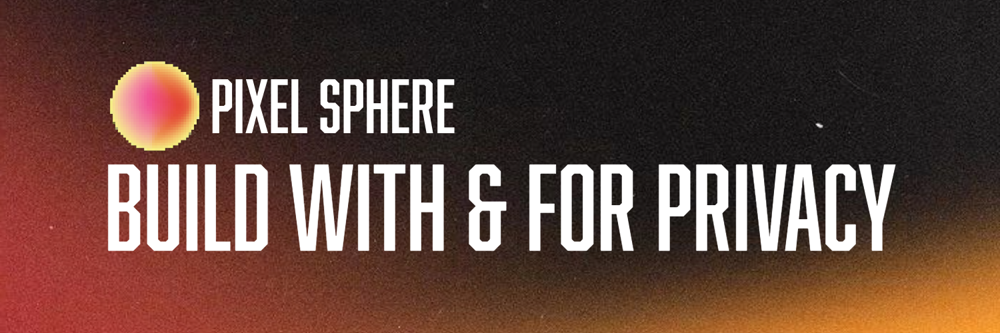

Our focus is on building clean, intuitive, and thoughtfully engineered software that delivers meaningful, practical value without unnecessary complexity. We believe technology should solve real problems in a straightforward and efficient way, not add layers of confusion.

Each project is developed with a strong emphasis on performance, long-term maintainability, and scalability. We prioritize clear architecture, well-structured code, and sustainable design practices to ensure our solutions remain reliable and adaptable over time. Privacy-first principles are embedded into every stage of development, ensuring that user data is respected, protected, and never treated as an afterthought.
